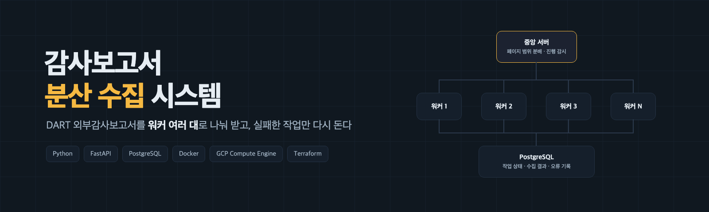

<p align="center">
  
</p>

<h3 align="center">DART 에서 외부감사보고서를 제출한 기업을 걸러 정리하는 분산 수집 시스템</h3>

<p align="center">
  <a href="#볼-만한-코드">볼 만한 코드</a> ·
  <a href="#실행">실행</a> ·
  <a href="GCP_TERRAFORM.md">GCP 배포</a> ·
  <a href="ARCHITECTURE.md">구조 문서</a>
</p>

<p align="center">
  
  
  
  
  
  
  
</p>

## 무엇을 하나

DART 공시 목록에서 외부감사보고서를 제출한 기업만 걸러 모으고, 기업마다 대표자명을 붙여 엑셀로 정리합니다.
기간 안의 공시가 수천 건이라 한 대로 돌리면 기한을 못 맞춰, 중앙 서버 한 대가 페이지 범위를 나눠 주고
워커 여러 대가 동시에 받습니다. 어느 워커가 중간에 죽어도 그 작업만 다른 워커가 이어받습니다.

**외주 · 단독 개발**

## 흐름

```
중앙 서버  /init      DART 전체 페이지 수 확인 → 워커 수만큼 페이지 범위로 나눠 DB 에 작업 등록
워커 N     /work      대기 작업 하나 받기 → 페이지 수집 → 대표자명 조회 → DB 저장 → 완료 보고
중앙 서버  /status    완료 · 실패 · 진행 중 작업 수
중앙 서버  /finalize  DB 의 수집 결과를 엑셀과 매칭(공시회사명 + 대표자명) → 엑셀 저장
```

## 구성

| 역할 | 스택 | 맡는 일 |
|---|---|---|
| central_server | FastAPI | 페이지 범위 분배, 진행 감시, 최종 엑셀 매칭 |
| worker_server | FastAPI · requests · BeautifulSoup | 할당받은 페이지 수집, 실패 보고 |
| db_models | SQLAlchemy · PostgreSQL | 작업 상태 · 수집 결과 · 오류 기록 |
| 배포 | Docker Compose(로컬) · GCP Compute Engine + Terraform(운영) | 중앙 1대 + 워커 10대를 한 번에 세움 |

## 볼 만한 코드

- **브라우저 없이 요청을 직접 부른다** — 처음엔 Selenium 으로 화면을 조작했는데 건마다 대기가 붙어
  느렸습니다. 화면이 보내던 요청을 `requests` 로 직접 부르고 `BeautifulSoup` 으로 읽어 실행 시간을 줄였습니다.
  → [`worker_server/main.py`](worker_server/main.py)
- **실패한 작업만 다시 돈다** — 작업 단위가 페이지 범위라, 실패는 그 범위만 `FAILED` 로 남고 재할당됩니다.
  워커가 죽으면 `IN_PROGRESS` 로 남은 작업을 다른 워커가 이어받습니다. 전체를 처음부터 다시 돌리지 않습니다.
  → [`central_server/main.py`](central_server/main.py)
- **몇 대까지 늘릴지** — 워커를 늘릴수록 비용은 곧게 오르는데 처리 이득은 완만해져, 요청당 비용이 이득을
  넘는 지점이 생겼습니다. 거기서 대수를 멈추고 단위 비용을 줄이는 쪽으로 바꿨습니다.
  → [`GCP_TERRAFORM.md`](GCP_TERRAFORM.md)

## 실행

```bash
cp .env.example .env      # DATABASE_URL · DART 기간 · 워커 수
docker-compose up -d
curl http://localhost:8000/init      # 작업 분배
curl http://localhost:8000/status    # 진행 확인
curl -X POST http://localhost:8000/finalize   # 엑셀 매칭
```

중앙 서버 http://localhost:8000 · 워커 http://localhost:8001 ~ 8010 · DB localhost:5432

## 만든 사람

**이승욱** · coms1768@gmail.com · 요구사항 정리부터 개발 · 배포 · 납품까지 단독
